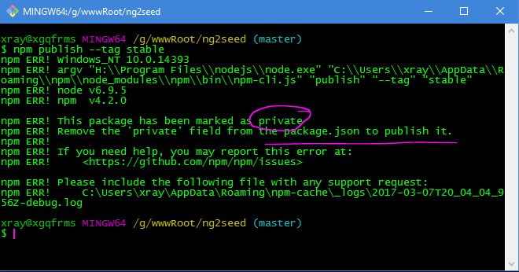

# ng2seed  

> ng2seed: Angular2 seed    

All guides and cookbooks have at least these core files.   

(app.component.ts, app.module.ts, main.ts)  

.png)

https://angular.io/docs/ts/latest/guide/setup.html

.png)

.png)

.png	)

.png	)
 


## ng2seed


G:\wwwRoot\ng2seed


npm publish --tag stable




https://github.com/xgqfrms/ng2seed


```json
  "repository": {
    "type": "git",
    "url": "git+https://github.com/xgqfrms/ng2seed.git"
  },
  "keywords": [
    "npm"
  ],
  "author": "xgqfrms",
  "license": "MIT",
  "bugs": {
    "url": "https://github.com/xgqfrms/ng2seed/issues"
  },
  "homepage": "https://github.com/xgqfrms/ng2seed#readme",
```


Collaborators Push access to the repository


Transfer repository


A Transfer repository B

===

B copy A & A deletee A


ng2seed

🎅❄🎄🎁🔀⛄🔔 ng2seed: All guides and cookbooks have at least these core files. (app.component.ts, app.module.ts, main.ts )https://angular.io/docs/ts/latest/guide/setup.html


